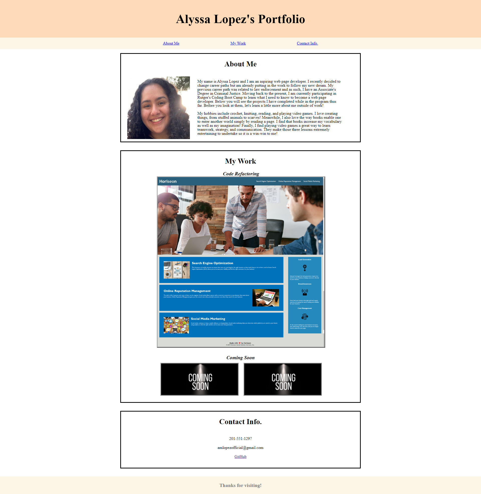

# Portfolio-of-Alyssa-Lopez
## Description:
The files found with this README file come together to create my portfolio as a web page developer. This portfolio was created from scratch. 

### HTML
In the HTML file, I did multiple things. I:

- Used semantic elements to create an easier to read code
- Created multiple sections and articles to properly group my code 
    - Such as the About Me, My Work, and Contact Info. sections)
- Coded the links in my nav bar to jump to said section's spot on the page
    - For some reason this does not work on GitHub Pages but does work via VS Code (please inform me of what to do in this situation)
- Added images to represent my work that went clicked on go to said work
    - I only have one real project as of right now so only the first image in my work links to another site
- Etc. 

### CSS
I coded many things within the CSS file for multiple reasons. I: 

- Created a reset style sheet.
- Created a regular style sheet.
    - Used comments to make the code easier to read
    - Changed the format and appearance of multiple general styles
    - Formatted all sections in my html to have a better appearance and format
    - Used flexboxes where necessary
    - Made my website responsive via the use of media query
    - Etc.

## Some Problem(s)
I feel the need to explain some things so I have done so below:

- As previously stated, the links in my navigation bar work in VS Code but do not in GitHub Pages. I read that others have also had this problem, but was unsure if I should attempt the work around or not. If I should, please inform me so that I can do so on my resubmission!

Please do not hesitate to inform or advise me on this or anything else in my code that could be done better. I truly appreciate the help!

## Screenshot:
Here is a screenshot of the finished product:

## Link to deployed application:

Here is the link to the deployed application via GitHub:

<a href="https://alylopez02.github.io/Portfolio-of-Alyssa-Lopez/">https://alylopez02.github.io/Portfolio-of-Alyssa-Lopez/</a>